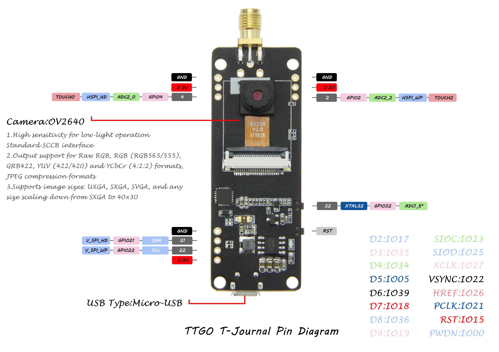

ESP32 Camera Ardunio Library
====================
## Important
This library has been deprecated, the official Arduino library already supports Camera, please update the Arduino library for use [esp32-camera] (https://github.com/espressif/esp32-camera/issues/7)

Each example is tested using the TTGO T-Journal.

The example contains three programs:
- Upload a photo to the [BIGIOT](https://www.bigiot.net/) platform every 30 seconds
- WiFi Soft-AP mode video stream 
- WiFi Station mode video stream

In order to use the Station mode for video transmission quality, it should be as close as possible to the router, and the Soft-AP mode should be as close as possible to the device.

This library is based on [esp32-cam-demo](https://github.com/igrr/esp32-cam-demo) changes and is used in Arduino.

# Installing
To install this library:
- Install [oled-ssd1306](https://github.com/ThingPulse/esp8266-oled-ssd1306),If you want to use oled.
- Install it using the Arduino Library manager ("Sketch" -> "Include Library" -> "Manage Libraries..."), or
- Download a zipfile from github using the "Download ZIP" button and install it using the IDE ("Sketch" -> "Include Library" -> "Add .ZIP Library..."
- Clone this git repository into your sketchbook/libraries folder.

For more info, see https://www.arduino.cc/en/Guide/Libraries

 # How to use
- Change the WiFi ssid and password in the program.
- In Sota-AP you should connect `TTGO-CAMERA` and password is "`12345678`" , enter `192.168.1.1` in the browser to access the video stream.
- In the Station mode, If you use OLED ,you should enter the IP address displayed in the OLED for access. You can also enter the IP address in the log to access
- If you run the [BIGIOT](https://www.bigiot.net/) sample program, you need to add the device ID, interface ID, and password to add your wifi account.